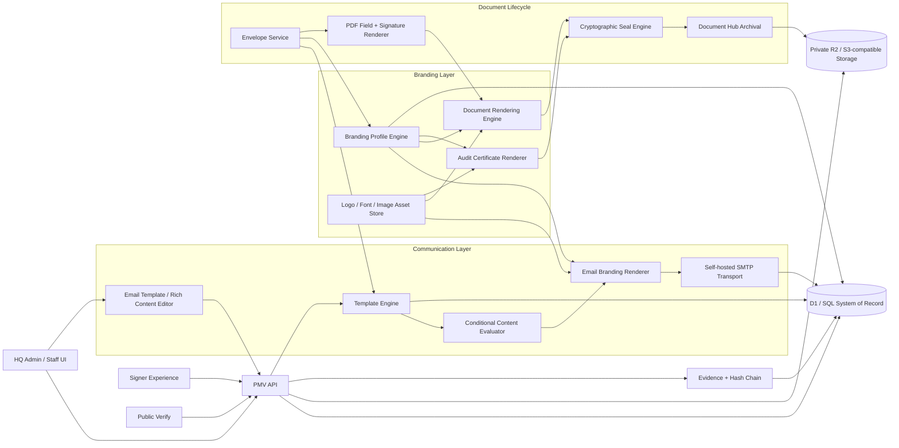
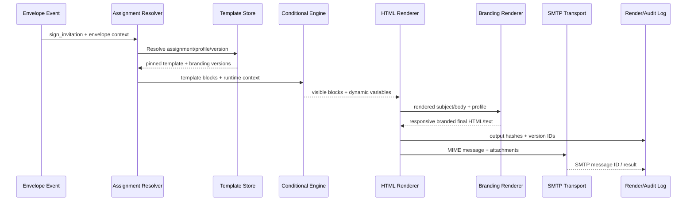
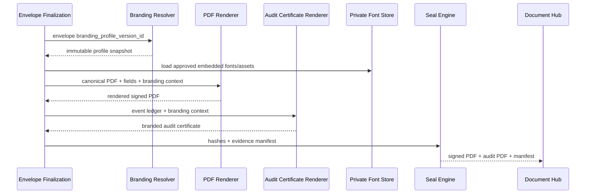

# PMV Communication & Branding Engine Architecture

This document extends the existing Pinnacle Document Lifecycle, e-Signature, Audit Trail, Document Hub, Community Documents, and public verification system. All rendering, storage, versioning, SMTP delivery, document branding, and template data remain self-hosted and controlled by PMV. No third-party email-template, e-signature, document-rendering, or branding service is required.

## 1. Updated System Architecture



### Core rule: immutable rendering references

Every outbound envelope communication and final document generation resolves:

1. the communication event (`sign_invitation`, `sign_reminder`, `sign_completion`, etc.);
2. the correct assignment scope (envelope > document type > organization > global);
3. the exact communication-template version;
4. the exact branding-profile version;
5. the render context used;
6. resulting output hashes.

Those IDs/hashes are logged so historical output is reproducible and auditable.

## 2. New Database Model

Migration: `migrations/0030_communication_branding_engine.sql`

### `branding_profiles`
Reusable branding themes applied to email, generated documents and audit certificates.

Important fields:
- `name`, `description`, `organization_key`
- default/active state
- logo file reference
- primary, secondary, accent, background and text colors
- heading/body font families
- custom-font asset references
- email header/footer HTML
- legal disclaimer and social links
- PDF header/footer text
- page size/orientation/margins
- signature-block and audit-table style JSON
- optional advanced CSS

### `branding_profile_versions`
Immutable snapshot of each saved branding revision.

A version snapshot contains every effective setting needed to reproduce prior output even when the live profile changes.

### `communication_templates`
Current editable template definition.

Supported types:
- invitation to sign
- reminder
- completion
- decline
- expiration
- internal notification
- custom

Contains:
- subject/preheader templates
- rich HTML + text fallback
- template CSS
- editor JSON
- variable schema
- conditional rules
- branding-profile association
- completion audit-certificate attachment setting

### `communication_template_versions`
Immutable saved versions of the template content and styling.

### `template_assignments`
Determines which template/branding combination applies to a specific event.

Resolution order:
1. envelope assignment
2. document-type assignment
3. organization assignment
4. global assignment

Lower `priority` wins within the same scope.

### `communication_render_logs`
One row per rendered/sent communication. Stores:
- envelope + recipient
- event type
- exact template/version
- exact branding/version
- recipient address
- rendered subject
- SHA-256 hashes of final HTML/text
- attachment manifest
- transport (`smtp`)
- transport message ID
- delivery result/error

This is separate from the legal envelope evidence chain but critical communication events should also append an envelope event.

### `custom_font_assets`
Tracks uploaded fonts stored privately in Document Hub object storage.

Fonts can be scoped to email, PDF or both.

### `template_change_events`
Administrative audit history for creation, updates, versioning, activation, assignments, archiving and test sends.

### Envelope additions
Envelopes can pin:
- branding profile
- branding profile version
- invitation template
- completion template
- document rendering context JSON

This prevents later template/branding changes from altering historical evidence.

## 3. Email Rendering Pipeline



### Runtime data context

The renderer receives a strict typed object rather than arbitrary database access. Example:

```ts
{
  signer: {
    name,
    email,
    role
  },
  envelope: {
    publicId,
    title,
    status,
    expiresAt,
    verificationUrl
  },
  organization: {
    name,
    legalName
  },
  sender: {
    name,
    email
  },
  custom: { ...approvedCustomFields }
}
```

Variables use a Mustache/Handlebars-style syntax such as:

```text
{{signer.name}}
{{envelope.title}}
{{formatDate envelope.expiresAt}}
```

Unknown variables fail validation in preview/save rather than silently producing malformed emails.

### Conditional content

Conditions are stored as structured JSON, not executable JavaScript. Example:

```json
{
  "all": [
    { "path": "signer.role", "op": "eq", "value": "notary" },
    { "path": "envelope.documentType", "op": "in", "value": ["affidavit","acknowledgment"] }
  ]
}
```

Allowed operations should be deliberately small: `eq`, `neq`, `exists`, `not_exists`, `in`, `not_in`, simple date/number comparisons.

No `eval`, arbitrary code or user-created SQL.

### HTML safety

- Editor produces a known component/block model.
- Server sanitizes HTML against an allow-list before saving and before sending.
- Inline CSS is generated from known tokens for maximum email-client support.
- Custom CSS is owner/admin-only and sanitized.
- External scripts, forms, iframes and executable content are forbidden.
- Background images must reference PMV-controlled asset URLs or embedded CID assets.

### SMTP transport

The template engine outputs a standard MIME message and calls a transport adapter. Production transport can use:

- a PMV-hosted Postfix/Exim/OpenSMTPD server;
- an authenticated corporate SMTP relay operated by PMV;
- another SMTP-compatible server under PMV control.

Business logic remains transport-agnostic.

## 4. Email Builder / Styling Model

Recommended UX: block-based visual builder with an optional advanced HTML/CSS panel.

Editable blocks:
- logo/header
- heading
- paragraph/rich text
- button
- image
- divider
- spacer
- two-column layout
- document summary
- signer summary
- legal/footer
- social links
- conditional container

Each block exposes controlled properties:
- font family
- font size/weight/style
- line height
- letter spacing
- text/background/border color
- alignment
- padding/margin
- border radius
- width/max-width
- mobile visibility/stacking

A preview panel renders desktop and mobile modes with selected sample/real envelope context.

## 5. Document & Audit PDF Branding Pipeline



### Signed-document controls

A branding profile can control:
- logo placement, dimensions and opacity
- first-page-only vs every-page header
- fonts
- brand colors
- footer/header text
- disclaimer blocks
- margins
- page size/orientation where a generated page is created
- signature-block appearance
- optional dynamic content before/after signing regions

For an uploaded source PDF, PMV should not destructively reflow the source. Branding can be overlaid only in safe configured regions or generated supplemental pages. This prevents unexpected alteration of legal source content.

### Audit-certificate controls

Audit PDF layout can use the full branding profile:
- cover/header treatment
- logo
- company/legal name
- color system
- font family
- event-table header/background/borders
- footer and disclaimer
- verification URL/ID
- hash/seal sections

The underlying evidence content remains canonical; branding controls presentation, never deletion or rewriting of required audit facts.

## 6. Open-Source Library Recommendations

All recommendations are locally hosted packages; none require hosted third-party services.

### Email templating / HTML rendering

**Recommended:**
- `handlebars` for variables and helper-driven rendering.
- `juice` for CSS inlining before SMTP delivery.
- `sanitize-html` for an allow-list sanitizer.
- `nodemailer` only as an SMTP client if/when the mail transport moves to a Node-compatible backend/service. It is not an email service.

Cloudflare Worker note: Nodemailer is Node-oriented. In the current Worker runtime, retain the existing mail adapter and add an SMTP service/worker behind a PMV-controlled endpoint if raw SMTP sockets are unavailable in Pages Functions.

### Rich/visual email editing

**Recommended:**
- `tiptap` (MIT core) for rich-text editing.
- `GrapesJS` (BSD-3-Clause) if a true drag/drop email/page builder is desired.

For PMV, a curated block builder built on Tiptap is preferable initially because unrestricted page-builder output often creates inconsistent email HTML.

### PDF + font handling

- Existing `pdf-lib` for PDF drawing/embedding.
- `fontkit` with pdf-lib for custom TrueType/OpenType font embedding.
- `opentype.js` where font metadata/measurement is useful in the frontend.

Do not load fonts from Google Fonts at render time. Store approved font binaries in private PMV storage and embed/self-host them.

### Template expression evaluation

- Handlebars helpers for variable formatting.
- Custom structured rule evaluator for conditional blocks. Avoid general-purpose JavaScript expression evaluators.

## 7. Template Versioning and Audit Rules

Editing a template/profile modifies its draft/current representation. Publishing or activating creates a new immutable version snapshot.

Envelopes and sent communication logs reference immutable version rows.

Actions recorded in `template_change_events`:
- create
- update
- version/publish
- activate
- archive
- assignment change
- test send

For higher assurance, template/version hashes can also be appended to the global admin audit log.

## 8. Completion Email + Audit Attachment

When an envelope reaches `completed` and sealing succeeds:

1. generate signed PDF, audit certificate and manifest;
2. resolve completion template and pinned branding;
3. build email runtime context;
4. conditionally include links/content blocks;
5. attach the audit certificate if `attach_audit_certificate=true`;
6. optionally attach final signed PDF when organizational policy allows;
7. log attachment file IDs + SHA-256 hashes in `communication_render_logs`;
8. send via PMV SMTP transport;
9. append `communication.completion_sent` to envelope evidence.

## 9. Central Branding & Communication Settings UI

Recommended HQ route: `Settings → Branding & Communications`.

Sections:

### Branding Profiles
- profile list
- default profile
- logo/assets
- colors
- typography/fonts
- document header/footer
- audit styling
- email header/footer
- legal disclaimer
- preview
- versions

### Email Templates
- event type filter
- template list/status
- visual rich-text/block editor
- desktop/mobile preview
- dynamic-variable browser
- condition builder
- test-send dialog
- versions/change notes
- assignment rules

### Assets
- logos
- email images
- uploaded font files
- usage/references

### Delivery
- SMTP configuration status
- sender identity
- test connection
- transport diagnostics

Sensitive SMTP credentials remain encrypted environment secrets, never returned to the browser.

## 10. Updated Implementation Roadmap

### Phase A — Foundation (schema/architecture)
- [x] Add branding profiles and immutable versions.
- [x] Add communication templates and versions.
- [x] Add assignment rules, render logs, font assets and change events.
- [x] Pin branding/template references on envelopes.
- [x] Document rendering and transport architecture.

### Phase B — Rendering services
- Build deterministic template-context resolver.
- Build Handlebars-style safe variable rendering.
- Build structured conditional rule evaluator.
- Add HTML sanitization and CSS inlining.
- Add branding-profile resolver/version snapshot service.
- Add communication render-log hashing.

### Phase C — Admin Branding & Communications UI
- Branding profile CRUD/versioning.
- Logo/image/font asset upload.
- Color/typography/document styling controls.
- Email template editor.
- Variable picker.
- Conditional block builder.
- Desktop/mobile preview using real/sample envelope data.
- Test-email delivery.

### Phase D — Lifecycle integration
- Replace hard-coded signer invitation HTML with assigned invitation template.
- Add reminder scheduling/template.
- Add decline and expiration email events.
- Add completion email after successful seal.
- Attach branded audit certificate according to template policy.
- Record exact version/hash metadata for every send.

### Phase E — PDF branding integration
- Embed branding-profile fonts with `fontkit`.
- Apply logo/header/footer/disclaimer controls to generated PMV pages.
- Apply signature-block theme.
- Rebuild audit certificate renderer around branding profile snapshot.
- Add dynamic document content-block renderer.
- Include effective branding/version IDs in signed evidence manifest.

### Phase F — Enterprise controls
- Organization-level profile/template assignments.
- Template approval workflow.
- owner-only custom CSS/code mode.
- accessibility checks and email-client compatibility checks.
- SMTP delivery analytics and bounce ingestion from PMV-controlled infrastructure.
- export/import branding/template packages for on-prem deployments.

## 11. Security Constraints

- No third-party document/email rendering services.
- No remote fonts or public asset dependency required.
- SMTP credentials are secret-server configuration only.
- Uploaded fonts/images are stored in private PMV object storage.
- HTML is sanitized.
- Conditional logic cannot execute arbitrary code.
- Template versions used in sent emails are immutable.
- Final render hashes are retained.
- Branding cannot alter canonical audit facts or hash-chain evidence.
- Owner/admin permissions govern templates, branding, font uploads and code/CSS mode.
