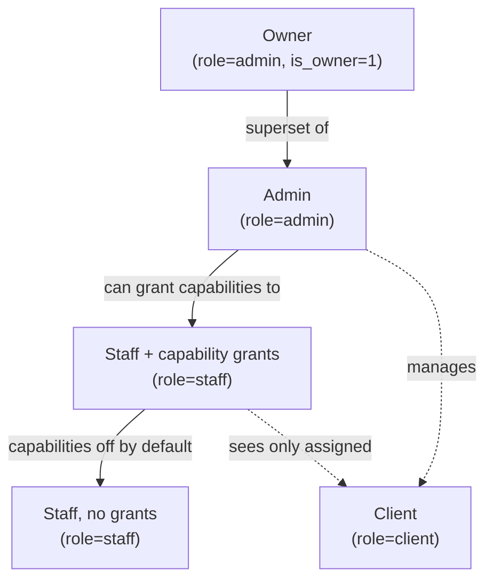
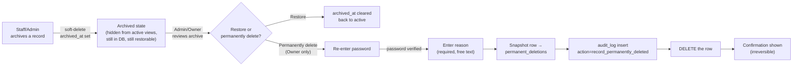
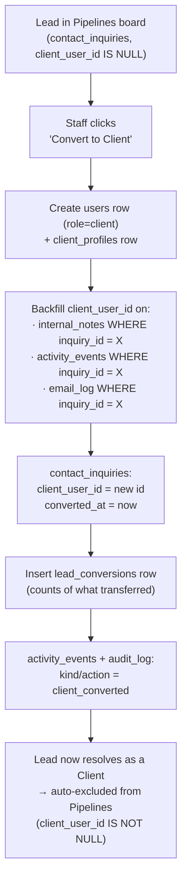
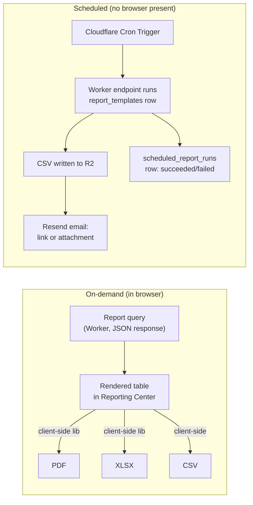
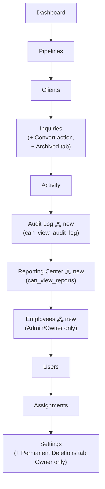
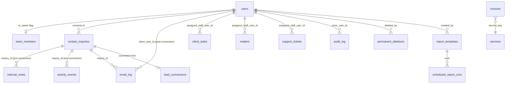

# CRM Expansion — Design Document

**Scope:** Permanent Deletion Controls · Lead Conversion System · Audit Log Center · Executive Reporting Dashboard · Employee Management Center

**Status:** Design + schema only. This document and the accompanying migrations (`0012`–`0016`) are the foundation — no routes or UI ship in this pass. See [Phased Implementation Plan](#phased-implementation-plan) for build-out sequencing.

**Grounded in:** the current PMV codebase (`functions/_lib/`, `src/pages/admin/`, `migrations/0001`–`0011`), not a green-field CRM. Every design choice below either reuses existing infrastructure (roles, capability flags, `activity_events`, the Pipelines board, Resend email) or explicitly says why it doesn't.

---

## Contents

1. [Key architecture decisions](#key-architecture-decisions)
2. [Role hierarchy & permissions matrix](#role-hierarchy--permissions-matrix)
3. [Permanent Deletion Controls](#1-permanent-deletion-controls)
4. [Lead Conversion System](#2-lead-conversion-system)
5. [Audit Log Center](#3-audit-log-center)
6. [Executive Reporting Dashboard](#4-executive-reporting-dashboard)
7. [Employee Management Center](#5-employee-management-center)
8. [Navigation structure](#navigation-structure)
9. [Dashboard & reporting layouts](#dashboard--reporting-layouts)
10. [Complete database schema](#complete-database-schema)
11. [Recommended automations](#recommended-automations)
12. [Scalability recommendations](#scalability-recommendations)
13. [Phased implementation plan](#phased-implementation-plan)

---

## Key architecture decisions

Four choices shape everything below. Each trades a "more obviously matches the spec's wording" option for a lower-risk one that reuses what's already load-bearing in this codebase.

| Decision | Chosen approach | Rejected alternative | Why |
|---|---|---|---|
| **"Owner" tier** | `team_members.is_owner` flag on top of the existing `admin` role | A 4th `users.role` value (`'owner'`) | Every authorization check in `functions/_lib/mid.ts` and route files branches on `role IN ('client','staff','admin')`. A new role value means auditing every one of those checks for a role the rest of the app doesn't know about. A flag is additive: an Owner is `role='admin' AND is_owner=1` — a strict superset, so nothing existing has to change, and only the one new permanent-delete endpoint needs to check it. |
| **Lead-stage data (notes/emails/activity)** | Attach via nullable `inquiry_id` columns on `internal_notes` / `activity_events`, backfilled to `client_user_id` at conversion | Make `client_tasks`/`client_documents`/`secure_messages.client_user_id` nullable too, for full symmetry | SQLite can only relax a `NOT NULL` constraint by rebuilding the table (copy → drop → rename), which is real risk to run against live data for three tables. It's also not clearly needed: `secure_messages` requires a logged-in client account to send at all, and formal deliverable tasks/documents don't really exist before someone is a client. Notes and outbound email are the actual pre-conversion touchpoints — those get the schema support; tasks/documents on a lead is flagged as a documented v2 gap, not silently dropped. |
| **Audit log** | New `audit_log` table, separate from `activity_events` | Extend `activity_events` with more columns | `activity_events` is tuned for the staff notification feed — per-user mute prefs, expected to be paginated/summarized for display. An audit log has different invariants (never edited, never pruned, captures before/after) that don't belong bolted onto a feed table. They're written together (same D1 batch) wherever both apply, so they can't drift. |
| **PDF/Excel export** | Client-side generation (fetch report JSON → render in-browser with a PDF/XLSX library) | Server-side rendering in the Worker | Cloudflare Workers have no native PDF renderer and no filesystem; server-side PDF means standing up a separate rendering service (Browser Rendering API or an external one). For tabular business reports (not pixel-perfect brand documents), client-side export is simpler, cheaper, and ships faster. Scheduled reports (which have no browser to render in) use CSV only in v1 — see [Scalability recommendations](#scalability-recommendations). |

---

## Role hierarchy & permissions matrix



Existing capability flags (`can_reveal_payment_info`, `can_manage_users`, `can_manage_settings`, all on `team_members`) are unchanged. Two new capabilities are added for this expansion: `can_view_reports` and `can_view_audit_log` — both off by default, grantable by an Admin the same way the existing three are, both implicitly true for Admin/Owner.

| Action | Client | Staff (no grants) | Staff + capability | Admin | Owner |
|---|:---:|:---:|:---:|:---:|:---:|
| View own records | ✅ | — | — | — | — |
| View assigned clients' records | — | ✅ | ✅ | ✅ (all) | ✅ (all) |
| Archive a record (soft-delete) | — | ✅ own client-scope | ✅ | ✅ | ✅ |
| Restore an archived record | — | ✅ own client-scope | ✅ | ✅ | ✅ |
| **Permanently delete a record** | — | — | — | — | ✅ only |
| View Audit Log Center | — | — | ✅ `can_view_audit_log` | ✅ | ✅ |
| Convert a lead to client | — | ✅ assigned | ✅ | ✅ | ✅ |
| Manage staff assignments | — | — | — | ✅ | ✅ |
| Grant/revoke capabilities | — | — | — | ✅ | ✅ |
| View Executive Reporting Dashboard | — | — | ✅ `can_view_reports` (own scope only) | ✅ (firm-wide) | ✅ (firm-wide) |
| Export a report | — | — | ✅ (own scope) | ✅ | ✅ |
| Schedule/save a report template | — | — | — | ✅ | ✅ |
| View Employee Management Center | — | — | — | ✅ | ✅ |
| Reveal payment info | — | — | ✅ `can_reveal_payment_info` | ✅ | ✅ |

A staff member with `can_view_reports` sees reports filtered to their own assigned clients/activity — the same `scopeFilter()` mechanism that already scopes every other staff-facing query, applied to report queries too. Firm-wide totals are Admin/Owner only.

---

## 1. Permanent Deletion Controls

### Workflow



Two distinct actions, two distinct privilege levels — this is the load-bearing distinction in the spec ("all non-owner users may only archive"):

- **Archive** — any staff/admin with access to the record. Sets `archived_at`/`archived_by`/`archived_reason`. Fully reversible. Archived records disappear from every active list view (Pipelines board, client lists, dashboards) via `WHERE archived_at IS NULL`, but remain queryable in an "Archived" view.
- **Permanently delete** — Owner only. A separate, deliberately heavier action:
  1. Re-authenticate: the request must include the Owner's current password, re-verified server-side against `password_hash` the same way login does (not just "you have an active session").
  2. Reason is required, free text, minimum length enforced.
  3. Server snapshots the full row into `permanent_deletions.snapshot_json` and writes an `audit_log` row, in the same D1 batch as the `DELETE` itself — so a deletion is never recorded without its audit trail, and never audited without actually happening.

### API surface (new)

```
PATCH  /admin/:entity/:id/archive     { reason?: string }        — any staff/admin with record access
PATCH  /admin/:entity/:id/restore     {}                          — any staff/admin with record access
GET    /admin/:entity/archived                                    — list archived records for an entity type
DELETE /admin/:entity/:id/permanent   { password, reason }        — Owner only (requireOwner middleware)
GET    /admin/permanent-deletions                                 — the permanent ledger, Owner-only, read-only
```

`:entity` is one of `inquiries | matters | tasks | invoices | documents | tickets | notes | users`. A single generic handler parameterized by table name (with a small allowlist to prevent arbitrary table access) avoids writing eight near-identical route pairs.

---

## 2. Lead Conversion System

### Workflow



This is one atomic action (a single D1 `batch()`), not a status dropdown that silently triggers side effects — "Convert to Client" is a deliberate button, same interaction pattern as the existing "Convert to client" link, but it now does the full transfer instead of just pre-filling a form.

**Why nothing is physically copied:** `internal_notes` and `activity_events` already carry a nullable `client_user_id`. Rows created while the lead was still a lead are stamped with `inquiry_id` instead. Conversion is an `UPDATE ... SET client_user_id = :new_id WHERE inquiry_id = :inquiry_id AND client_user_id IS NULL` — the same rows, now queryable both ways. No data is duplicated, nothing can be transferred twice, and there's no risk of a partial copy leaving stale duplicates behind.

**Automatic disappearance from the pipeline:** the Pipelines board's inquiry query gains `AND client_user_id IS NULL AND archived_at IS NULL` — conversion and archiving both remove a lead from the active board through the same mechanism list views already use, no separate "hide converted leads" flag to keep in sync.

**Archived lead retrieval:** covered by the same Permanent Deletion Controls archive mechanism (§1) applied to `contact_inquiries` — "administrative review of archived leads" is the existing `GET /admin/inquiries/archived` view, not a separate system.

### API surface (new)

```
POST /admin/inquiries/:id/convert     {}   — atomic conversion, returns the new client_user_id
GET  /admin/inquiries/:id/conversion       — conversion record + transferred-item counts, if converted
GET  /admin/conversions                    — conversion history log (date range, converted-by filters)
```

---

## 3. Audit Log Center

### Event taxonomy

`audit_log.action` values, and where each is written from (existing file, or new):

| Action | Source |
|---|---|
| `login` / `logout` | `functions/_lib/routes/auth.ts` (new inserts — today neither is logged anywhere) |
| `record_created` / `record_updated` | Every `POST`/`PATCH` in `portal.ts` and `admin.ts` that currently calls `activityInsert()` gains a parallel `audit_log` insert in the same batch |
| `record_archived` / `record_deleted` | New archive/permanent-delete routes (§1) |
| `record_permanently_deleted` | New permanent-delete route (§1) — always paired with a `permanent_deletions` row |
| `email_sent` | `functions/_lib/email.ts` `sendEmail()` — one audit row per send, alongside the new `email_log` insert |
| `status_changed` | Existing status-change routes (matters, tasks, tickets, invoices, funding, users) |
| `permission_changed` | Capability grant/revoke routes in `admin.ts`, staff role changes |
| `task_assigned` | `client_tasks`/`matters` assignment (new `assigned_staff_user_id` column, §5) |
| `file_uploaded` | `functions/_lib/routes/uploads.ts` |
| `client_converted` | New conversion route (§2) |

### UI

A new **Audit Log** admin page (`can_view_audit_log` or Admin/Owner): filterable table (actor, action, entity type, date range), server-paginated (never load the full table client-side — see [Scalability](#scalability-recommendations)), read-only, CSV export using the same client-side export path as the Reporting Dashboard.

---

## 4. Executive Reporting Dashboard

### Report catalog

Every report below is a parameterized SQL aggregation over existing tables (plus the new `assigned_staff_user_id`/`service_key` attribution columns from migration `0015`/`0016`) — no new data model beyond attribution. All support a date range; scope (firm-wide vs. own-clients) follows the permissions matrix in §[Role hierarchy](#role-hierarchy--permissions-matrix).

**Business:** Total Leads · New Leads This Month · Converted Leads · Conversion Rate · Active Clients · Inactive Clients · Lost Opportunities · Revenue by Client · Revenue by Service · Revenue by Month · Revenue by Employee · Outstanding Invoices · Collections Summary

**Employee:** Tasks Assigned · Tasks Completed · Tasks Overdue · Client Interactions · Emails Sent · Notes Added · Average Response Time · Employee Activity Rankings

**Client:** New Clients · Active Clients · At-Risk Clients (heuristic: no activity in N days, configurable) · Client Retention · Client Engagement Metrics

**Operations:** Open Support Requests · Average Resolution Time · Open Projects · Project Completion Rates · Department Performance (by `team_members.staff_role`)

### Export & scheduling architecture



- **On-demand PDF/XLSX**: generated entirely client-side from the already-fetched report JSON (see [Key architecture decisions](#key-architecture-decisions) for why). CSV is trivial either side and is generated server-side for scheduled runs.
- **Scheduled reports**: a `report_templates` row with `schedule_cron` set is picked up by a Cloudflare Cron Trigger (`wrangler.toml` `[triggers]`) hitting a dedicated Worker endpoint. That endpoint re-runs the saved report's query, writes CSV to R2 (reusing the existing `UPLOADS` bucket infrastructure with a `reports/` key prefix), and emails the firm-notify or template's `recipients_json` via the existing Resend integration. Every run's outcome is logged to `scheduled_report_runs` so the Reporting Center can show "last run: succeeded 3h ago" instead of a schedule silently going stale.
- **Saved templates**: `report_templates` stores `report_key` + `filters_json` (date range, scope) so "Revenue by Month, last quarter, my clients only" is a named, reusable, optionally-scheduled definition rather than re-entering filters every time.

---

## 5. Employee Management Center

Built entirely on attribution columns added in migration `0016` — no new tables beyond what Reporting already needs.

| Metric | Source |
|---|---|
| Login history | `audit_log WHERE actor_user_id = ? AND action = 'login'` |
| Last activity | `users.last_seen_at` (touched, throttled, from `requireUser` middleware — far cheaper than scanning `audit_log` for `MAX(created_at)` per employee on every dashboard load) |
| Tasks completed / completion rate | `client_tasks WHERE assigned_staff_user_id = ?` grouped by `status` |
| Client interactions | `activity_events WHERE actor_user_id = ?` |
| Emails sent | `email_log WHERE sent_by_user_id = ?` |
| Notes added | `internal_notes WHERE author_user_id = ?` |
| Average response time | `support_tickets.first_response_at - created_at`, averaged, `WHERE assigned_staff_user_id = ?` |
| Time spent in system | **Flagged limitation** — see below |
| Performance metrics / activity rankings | The above metrics, combined and sorted, `GROUP BY assigned_staff_user_id` |

**"Time spent in system" is an approximation, not a precise measurement**, and this document says so explicitly rather than implying otherwise: without a heartbeat/ping endpoint (out of scope for v1 — adds a recurring request from every open tab), the only available signal is the gap between consecutive `login`/`logout` audit events, which undercounts anyone who closes a tab without explicitly logging out. If precise time-on-system becomes a real requirement, the v2 addition is a lightweight `POST /me/heartbeat` pinged every few minutes while a session is active, feeding a `session_duration_log` table — deliberately not built now, to avoid the added request volume until the coarser approximation is shown to be insufficient.

---

## Navigation structure

New sections (Owner/Admin visibility unless noted) slot into the existing admin nav (`src/components/layout/nav.ts`) rather than replacing it:



- **Inquiries** gains a "Convert to Client" action per qualified/converted lead card and an "Archived" tab (existing pattern — matches how `NoAccess`/tabbed views already work in `SettingsAdmin.tsx`).
- **Audit Log** and **Reporting Center** are new top-level items, gated by the two new capability flags — same nav-visibility pattern `AdminApp.tsx`'s `STAFF_VISIBLE` set already uses for Pipelines/Clients/Inquiries/Activity.
- **Employees** is Admin/Owner only (no capability grant — this is deliberately not delegable, since it exposes every staff member's activity/performance data).
- **Settings** gains a **Permanent Deletions** tab, visible only to an Owner (`is_owner=1`), listing archived records across all entity types with the permanent-delete action.

---

## Dashboard & reporting layouts

### Executive Reporting Dashboard — landing view

| Region | Content |
|---|---|
| Header | Date-range picker (applies to every widget below), scope toggle (firm-wide / my clients, staff only), Export ▾ (PDF/XLSX/CSV), Save as template |
| Top row — KPI strip | Total Leads · Conversion Rate · Active Clients · Revenue (period) · Outstanding Invoices — each a number + trend vs. previous period, not a chart |
| Tab strip | Business · Employee · Client · Operations (matches the four report categories in §4) |
| Body | Selected category's reports as a mix of tables (e.g. Revenue by Client) and small charts (e.g. Revenue by Month as a bar chart, Employee Activity Rankings as a ranked list) |
| Footer | Saved report templates for the current user — name, last-run status, "Run now" |

### Employee Management Center — landing view

| Region | Content |
|---|---|
| Header | Date-range picker, department filter (`staff_role`) |
| Roster table | One row per staff member: name/role, last activity, tasks completed rate, avg. response time, a compact activity sparkline — sortable by any column (this is the "scanned, not read" surface — see design notes) |
| Detail panel (on row click) | Login history, full task list with status breakdown, notes/emails logged, capability grants — the per-employee drill-down |

---

## Complete database schema

All of the following ship as migrations `0012`–`0016` in this PR (see the actual `.sql` files for full DDL with comments explaining each choice) — this section is the consolidated reference.



**Migration `0012` — Owner role + deletion controls**
- `team_members.is_owner` (INTEGER, default 0)
- `archived_at` / `archived_by` / `archived_reason` added to: `contact_inquiries`, `matters`, `client_tasks`, `invoices`, `client_documents`, `support_tickets`, `internal_notes`
- New table `permanent_deletions` (id, entity_type, entity_id, snapshot_json, deleted_by, reason, actor_ip, deleted_at)

**Migration `0013` — Lead conversion**
- `contact_inquiries.client_user_id`, `contact_inquiries.converted_at`
- `internal_notes.inquiry_id`, `activity_events.inquiry_id`
- New table `email_log` (id, direction, inquiry_id, client_user_id, sent_by_user_id, to_address, subject, body, provider_message_id, created_at)
- New table `lead_conversions` (id, inquiry_id, client_user_id, converted_by, notes_transferred, emails_transferred, activity_transferred, created_at)

**Migration `0014` — Audit log**
- New table `audit_log` (id, actor_user_id, actor_ip, action, entity_type, entity_id, before_json, after_json, created_at)

**Migration `0015` — Reporting attribution**
- `invoices.service_key`, `invoices.assigned_staff_user_id`
- New table `report_templates` (id, name, report_key, filters_json, schedule_cron, recipients_json, created_by, created_at)
- New table `scheduled_report_runs` (id, template_id, status, export_r2_key, error, run_at)

**Migration `0016` — Employee metrics**
- `users.last_seen_at`
- `client_tasks.assigned_staff_user_id`, `matters.assigned_staff_user_id`, `support_tickets.assigned_staff_user_id`, `support_tickets.first_response_at`

---

## Recommended automations

Ranked by how directly they reuse infrastructure that already exists (Resend email, `activity_events`, the capability system) versus needing new plumbing:

1. **Conversion confirmation email** — on `client_converted`, auto-send the new client a welcome email via the existing `notifyStaff`-adjacent `sendEmail()` path. Near-zero new code.
2. **Stale-lead nudge** — a lead sitting in `new`/`contacted` for N days with no activity gets flagged (badge on the Pipelines card) and optionally emails the assigned staff. Reuses `activity_events`/`email_log` timestamps, no new table.
3. **Owner digest on permanent deletions** — since permanent deletion is Owner-only but staff can archive, a weekly digest email to Owners of "records archived but not yet reviewed for X+ days" closes the loop without the Owner having to remember to check.
4. **Scheduled report delivery** — covered in §4; the general mechanism (Cron Trigger → Worker → R2 → Resend) is reusable for any future scheduled job, not just reports.
5. **Overdue task/ticket escalation** — a task past `due_date` or a ticket past an SLA threshold with no `first_response_at` auto-notifies the assignee's manager (`staff_role`-based, once a manager relationship exists — currently flat, so this is a v2 item pending that hierarchy).

---

## Scalability recommendations

- **D1 is SQLite, not a distributed OLAP store.** Every report query in §4 must be indexed on its `WHERE`/`GROUP BY` columns — the attribution columns added in `0015`/`0016` all ship with indexes for exactly this reason. Revenue-by-month/by-client aggregations over the full `invoices` table are fine at PMV's likely scale (thousands, not millions, of rows); if that changes, the mitigation is precomputed daily rollup tables refreshed by a Cron Trigger, not query tuning alone.
- **Audit log and email log grow unboundedly by design** — they must never be pruned by app code (that would defeat their purpose). Budget for D1 storage growth and consider a periodic export-to-R2-then-archive strategy once row counts get large enough to affect query latency, rather than deleting rows.
- **Report export happens client-side** specifically so PDF/XLSX generation never blocks a Worker's CPU-time budget (Workers have a hard execution limit; a large report rendered server-side risks hitting it). This also means very large exports (tens of thousands of rows) should paginate the underlying query and stream, rather than fetching everything into the browser at once — a real constraint worth testing before Executive Reporting ships, not assumed away.
- **Scheduled reports run on Cron Triggers, not inside a user request** — so a slow report never affects page load, and a failed scheduled run is visible (`scheduled_report_runs.status`) instead of silently not happening.
- **Audit Log Center pagination is server-side from day one** — with potentially years of history, a client-fetches-everything-then-filters pattern (which a couple of existing admin list pages use today, fine at their current row counts) will not hold up here.
- **`last_seen_at` writes are throttled** (e.g., only updated if the existing value is >5 minutes old) so "who's active" tracking doesn't turn into a write on every single authenticated request.

---

## Phased implementation plan

This is a multi-week build, not a single PR. Recommended sequencing, each phase shippable and useful on its own:

1. **Phase 1 (this PR): schema + design.** Migrations `0012`–`0016`, this document. No behavior changes to the running app.
2. **Phase 2: Permanent Deletion Controls.** Highest-leverage, most self-contained — archive/restore/permanent-delete routes and UI, Owner flag wiring, `permanent_deletions` ledger view.
3. **Phase 3: Lead Conversion System.** Convert action, pipeline auto-exclusion, conversion history log.
4. **Phase 4: Audit Log Center.** Instrument login/logout first (currently unlogged at all), then backfill `audit_log` writes alongside existing `activity_events` call sites, then the Audit Log admin page.
5. **Phase 5: Employee Management Center.** Needs the assignment columns from `0016` wired into task/matter/ticket creation UI first (assign-to-staff picker doesn't exist yet), then the roster/detail views.
6. **Phase 6: Executive Reporting Dashboard.** The largest phase — report query library, KPI strip, per-category views, then export, then scheduling last (it depends on everything else being stable and correct first, since a wrong scheduled report silently emailing bad numbers is worse than a wrong on-demand one someone visually double-checks).

Each phase is a separate PR against `main`, reviewed and deployed independently, so the firm gets value incrementally instead of waiting on the entire epic.
