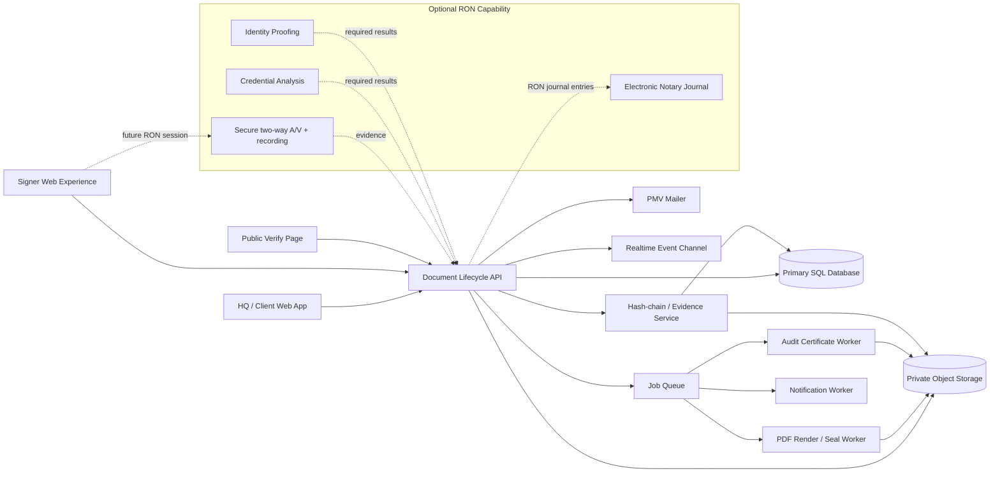

# Pinnacle Document Lifecycle Architecture

> **Important compliance note**: This design targets strong electronic-signature evidentiary integrity and a future RON-capable architecture. It must **not** be represented as Florida RON-compliant or guaranteed court-admissible until the complete RON workflow, service-provider registration/self-certification, notary procedures, identity-proofing/credential-analysis requirements, audio-video requirements, retention rules, and applicable legal review are satisfied.

## 1. Product Scope

The Pinnacle Document Lifecycle module is an internal-first document creation, e-signature, evidence, and archival system that plugs into the existing HQ Document Center and client records.

Core capabilities:

- Upload PDF and DOCX source files.
- Convert DOCX to canonical PDF before signing.
- Visual drag/drop fields: signature, initials, date, text, checkbox.
- Create envelopes with one or more ordered/unordered signers.
- Email signer invitations and OTP challenges.
- Track Draft → Sent → Viewed → In Progress → Completed / Declined / Expired.
- Capture evidence for every security-relevant action: UTC timestamp, IP, derived coarse geolocation, browser/user agent, device binding identifier, request/session ID, and actor.
- Produce a final signed PDF plus a branded audit certificate.
- Archive the immutable evidence bundle in the Document Hub.
- Provide a privacy-preserving public verification endpoint for document/envelope IDs.

## 2. Recommended Architecture

The existing PMV application should remain the system of record. A separate Next.js/NestJS rewrite would add operational complexity without improving the first implementation. The recommended approach is to add a dedicated document-signing domain to the current application and keep the interfaces modular enough to split into services later.



### Technology choices

- **Frontend:** existing React/TypeScript/Tailwind stack, using PDF.js for page rendering and Pointer Events for field placement.
- **PDF editing:** `pdf-lib` for field appearance/flattening; use a dedicated server-side signer for cryptographic PDF signatures/seals.
- **DOCX:** LibreOffice headless or another open-source converter in an isolated worker container; the canonical signing artifact is always PDF.
- **Database:** keep the current database for initial integration; PostgreSQL is preferred if/when the document service is separated.
- **Storage:** S3-compatible private object storage (MinIO, Cloudflare R2, AWS S3) behind a storage adapter. Never expose permanent object URLs.
- **Queue:** existing platform queue if available; otherwise Redis + BullMQ for conversion, sealing, audit PDF, notification, and expiry jobs.
- **Realtime:** SSE/WebSocket channel for envelope status updates; polling fallback.
- **Crypto:** SHA-256 for content/event digests, HMAC-SHA-256 for server-authenticated event links, Ed25519 or ECDSA P-256 signing key for signed evidence manifests. Production keys belong in a KMS/HSM or sealed on-prem key service, not source code.

## 3. Database Schema

### `document_files`
Canonical stored files and generated artifacts.

- `id` UUID PK
- `owner_client_id` nullable FK
- `created_by_user_id` FK
- `kind` enum: `source`, `canonical_pdf`, `signed_pdf`, `audit_certificate`, `evidence_manifest`, `attachment`
- `original_name`
- `mime_type`
- `storage_key` unique
- `size_bytes`
- `sha256`
- `encryption_key_ref` nullable
- `created_at`
- `retention_until` nullable
- `legal_hold` boolean default false

### `document_templates`
- `id` UUID PK
- `name`
- `description`
- `canonical_file_id` FK → document_files
- `status` enum: `draft`, `active`, `archived`
- `created_by_user_id`
- `created_at`, `updated_at`

### `envelopes`
- `id` UUID PK
- `public_id` unique, non-sequential human-safe identifier (example `PMV-9F4K-7Q2M`)
- `title`
- `message` nullable
- `client_id` nullable
- `template_id` nullable
- `source_file_id` FK
- `canonical_file_id` FK
- `final_signed_file_id` nullable FK
- `audit_certificate_file_id` nullable FK
- `evidence_manifest_file_id` nullable FK
- `status` enum: `draft`, `sent`, `viewed`, `in_progress`, `completed`, `declined`, `expired`, `voided`
- `signing_order_mode` enum: `parallel`, `sequential`
- `expires_at` nullable
- `sent_at`, `completed_at`, `declined_at`, `voided_at` nullable
- `created_by_user_id`
- `created_at`, `updated_at`

### `envelope_recipients`
- `id` UUID PK
- `envelope_id` FK
- `role` enum: `signer`, `approver`, `cc`, `witness`, `notary`
- `routing_order` integer default 1
- `name`
- `email`
- `phone_e164` nullable
- `status` enum: `pending`, `invited`, `viewed`, `authenticated`, `in_progress`, `completed`, `declined`, `expired`
- `auth_policy_id` nullable FK
- `invitation_token_hash`
- `invitation_expires_at`
- `first_viewed_at`, `completed_at`, `declined_at` nullable
- `created_at`, `updated_at`

### `document_fields`
Coordinates are normalized 0–1 values so fields remain stable across renderer sizes.

- `id` UUID PK
- `envelope_id` FK
- `recipient_id` FK
- `page_number` integer
- `field_type` enum: `signature`, `initial`, `date`, `text`, `checkbox`
- `x`, `y`, `width`, `height` decimal
- `required` boolean
- `label` nullable
- `validation_json` nullable
- `value_text` nullable
- `value_file_id` nullable FK
- `completed_at` nullable
- `created_at`, `updated_at`

### `auth_policies`
- `id` UUID PK
- `name`
- `require_email_otp` boolean
- `require_sms_otp` boolean
- `require_device_binding` boolean
- `require_kba` boolean
- `max_attempts` integer
- `otp_ttl_seconds` integer
- `created_at`

### `otp_challenges`
Never store plaintext OTP codes.

- `id` UUID PK
- `recipient_id` nullable FK
- `user_id` nullable FK
- `channel` enum: `email`, `sms`
- `destination_masked`
- `code_hash`
- `expires_at`
- `attempt_count`
- `consumed_at` nullable
- `created_at`

### `kba_challenges`
Custom KBA can be used for PMV business workflows but must not be described as Florida RON identity proofing unless it satisfies the applicable statutory/rule standards.

- `id` UUID PK
- `recipient_id` FK
- `question_set_version`
- `question_hash`
- `answer_hash`
- `attempt_count`
- `passed_at` nullable
- `created_at`

### `device_bindings`
- `id` UUID PK
- `subject_type` enum: `user`, `recipient`
- `subject_id`
- `binding_token_hash`
- `fingerprint_hash`
- `first_seen_at`, `last_seen_at`
- `revoked_at` nullable

### `envelope_events`
Append-only. Application UPDATE/DELETE permissions should be denied.

- `id` UUID PK
- `envelope_id` FK
- `recipient_id` nullable FK
- `actor_type` enum: `staff`, `client`, `signer`, `system`, `notary`
- `actor_id` nullable
- `event_type`
- `event_version` integer
- `occurred_at_utc`
- `ip_address` encrypted or restricted-access
- `geo_city`, `geo_region`, `geo_country` nullable
- `geo_lat_approx`, `geo_lon_approx` nullable
- `user_agent` nullable
- `browser_family`, `os_family`, `device_class` nullable
- `device_fingerprint_hash` nullable
- `session_id` nullable
- `request_id`
- `metadata_json`
- `prev_event_hash`
- `event_hash`
- `server_signature` nullable
- `created_at`

### `envelope_seals`
- `id` UUID PK
- `envelope_id` FK
- `seal_version`
- `final_pdf_sha256`
- `audit_pdf_sha256`
- `manifest_sha256`
- `event_chain_head_hash`
- `signature_algorithm`
- `public_key_id`
- `digital_signature`
- `sealed_at`

### `verification_records`
Contains only data approved for public disclosure.

- `id` UUID PK
- `envelope_id` unique FK
- `public_id` unique
- `verification_status` enum: `valid`, `voided`, `revoked`, `unknown`
- `document_label` nullable/sanitized
- `issuer_name` default `Pinnacle Management Ventures`
- `completed_date` nullable DATE
- `signer_count` integer
- `final_pdf_sha256_prefix` nullable
- `sealed_at` nullable
- `updated_at`

### RON-specific extension tables (future capability)

`ron_sessions`
- envelope/recipient/notary IDs, started/completed timestamps, location declarations, A/V recording file ID, uninterrupted recording hash, session status.

`ron_identity_checks`
- credential type, credential-analysis result/status, identity-proofing method/result, provider/output references, timestamps. Do not store more credential data than legally required.

`ron_journal_entries`
- notarial act type, record description, principal name/address, identity-evidence notation, fee, timestamps, notary ID, immutable hash.

## 4. Tamper-Evident Security Model

### A. Canonicalization
Before hashing an event, serialize a versioned JSON structure using deterministic canonical JSON. Exclude mutable database metadata.

### B. Event hash chain
For event `n`:

```text
event_hash_n = SHA256(
  "PMV-EVENT-V1" ||
  envelope_id ||
  prev_event_hash ||
  canonical_event_payload
)
```

The first event uses an all-zero or domain-specific genesis hash.

### C. Server authentication
The server signs each critical event hash or, at minimum, checkpoint hashes using an asymmetric signing key. The final evidence manifest contains:

- envelope ID/public ID
- final PDF SHA-256
- audit PDF SHA-256
- chain head hash
- ordered event hashes
- algorithm identifiers
- key ID/public-key fingerprint
- creation timestamp

The manifest is digitally signed. Any changed event, changed PDF, reordered event, or replaced certificate causes verification failure.

### D. Storage immutability
- Signed documents and evidence artifacts are write-once at the application layer.
- Storage keys are content-addressed/versioned.
- Enable object-lock/WORM where the chosen storage supports it.
- Encryption at rest with per-environment managed keys.
- No endpoint overwrites a completed envelope artifact; corrections create a new envelope/version.

### E. Least privilege
Suggested permissions:

- `documents.read`
- `documents.create`
- `documents.send`
- `documents.manage_templates`
- `documents.view_evidence`
- `documents.download_signed`
- `documents.void`
- `documents.admin`

Only owners/admins should be able to alter retention policy, signing keys, or verification configuration.

### F. Network/session controls
- HTTPS only; HSTS.
- HttpOnly/Secure/SameSite cookies for staff/client sessions when possible.
- Short-lived signer invitation session after token redemption.
- OTP challenge rate limits by recipient, IP, envelope, destination, and global abuse counters.
- CSRF protection for authenticated browser writes.
- Content Security Policy prohibiting arbitrary frames/scripts.
- Malware scan uploaded files before conversion/display.
- Strip active content from source office documents; signing occurs only against canonical PDF.

## 5. Detailed Flows

### A. Create envelope and place fields

1. Staff opens **Document Hub → Envelopes → New Envelope**.
2. Upload PDF/DOCX or choose a template/client document.
3. Backend stores the source, computes SHA-256, records `document.uploaded` event.
4. DOCX is queued for isolated conversion; PDFs are normalized.
5. Canonical PDF is stored and hashed.
6. UI renders pages with PDF.js.
7. Staff adds recipients and chooses parallel/sequential routing.
8. Staff drags fields onto pages. UI stores normalized coordinates and recipient ownership.
9. Server validates every required signer has required fields and no field lies outside page bounds.
10. Envelope remains `draft` until Send.
11. On Send, invitation tokens are generated, only token hashes are stored, invitation emails are queued, and `envelope.sent` is appended to the evidence chain.

### B. Signer authentication and signing

1. Signer opens one-time invitation link.
2. Server validates token hash, expiry, envelope state, and routing order.
3. Record `recipient.link_opened` with evidence metadata.
4. Required authentication policy runs:
   - email OTP;
   - optional SMS OTP;
   - optional PMV KBA;
   - device binding.
5. Every challenge creation/pass/failure is an immutable event; raw OTP/KBA answers are never logged.
6. After authentication, create a short-lived signing session bound to recipient + envelope + device/session.
7. Render canonical PDF and only fields assigned to that recipient.
8. Signature capture options can include typed signature, drawn signature, or uploaded signature image; record the selected method, not biometric inference.
9. Required fields are validated server-side.
10. Signer explicitly confirms intent/consent to use an electronic signature and submits.
11. Values are persisted, recipient marked complete, event hash appended.
12. Next recipient is invited if routing is sequential.
13. When all required recipients complete, finalization is queued.

### C. Audit generation and digital sealing

1. Worker obtains canonical PDF, ordered field values, recipient identities, and complete event chain.
2. Recompute the full chain from genesis; abort if any link is invalid.
3. Apply signature/field appearances to a new final PDF and flatten form content.
4. Compute final PDF SHA-256.
5. Build branded audit certificate with:
   - PMV logo/legal name;
   - public and internal envelope IDs;
   - creation/sent/completed times in UTC;
   - recipient list and signing order;
   - authentication method summary;
   - chronological event table;
   - IP/coarse geolocation/device/user-agent evidence subject to access controls;
   - hashes and chain head;
   - legal/evidentiary disclaimer;
   - verification URL/public ID.
6. Store audit PDF and compute its hash.
7. Generate signed JSON evidence manifest.
8. Optionally embed a cryptographic PDF signature/seal into final PDF using the PMV document-sealing certificate/key. This cryptographic seal proves integrity; it is distinct from claiming a notarial seal or qualified/trusted certificate status.
9. Save `envelope_seals` record and append `envelope.sealed` event.
10. Mark envelope `completed` only after all immutable artifacts are safely archived.

### D. Automatic archival into Document Hub

1. Create/associate Document Hub entries for:
   - Original source
   - Canonical PDF
   - Final signed PDF
   - Audit certificate
   - Signed evidence manifest
   - RON A/V recording and journal record when applicable
2. Mark final artifacts `immutable=true` at the application layer.
3. Index only safe metadata for search; never index OTP values or sensitive credential payloads.
4. Attach the envelope to the relevant client record and show status/history in HQ and the client portal as permissions allow.
5. Schedule retention/expiry jobs but never purge anything on legal hold.

## 6. Public Verification Page

Route: `/verify`

Input:
- Public document/envelope ID.

Public output only:
- `Verified / Not found / Voided` result
- Public ID
- Issuer: Pinnacle Management Ventures
- Completion/seal date
- Number of signers (optional)
- Sanitized document label (optional)
- Short SHA-256 fingerprint or downloadable verifier manifest if policy permits
- Explanation that verification confirms PMV's stored integrity record and does not expose the document or signer personal information

**Never expose publicly:** signer names/emails/phones, IPs, coordinates, device fingerprints, full user-agent strings, OTP/KBA data, source/signed files, client association, internal IDs.

The verification API must use strict rate limiting and constant-format responses to reduce enumeration risk. Public IDs should contain at least ~80 bits of randomness and never be sequential.

## 7. Florida RON Gap Analysis

A robust electronic-signature system is not automatically a Florida RON system.

For Florida online notarization, the architecture must support the statutory requirements in Chapter 117, including real-time two-way audio/video, recording the complete online notarization session, secure retention of recordings/journals, proper notary registration/procedure, and qualifying identity verification. Florida law specifically contemplates government-ID presentation, credential analysis, and identity proofing unless the notary personally knows the principal. Credential analysis is defined as involving a third party, so a blanket requirement of “no external identity verification APIs” conflicts with a normal Florida RON implementation unless another legally compliant path applies.

Accordingly:

- Phase 1 should be branded PMV electronic signatures + evidentiary audit trail.
- Phase 2 can add RON-specific journal/A-V/notary workflow behind a feature flag.
- Do not market Phase 2 as RON-compliant until counsel and the Florida Department of State requirements/provider filings have been satisfied.

## 8. Implementation Phases

### Phase 1 — Envelope foundation
Schema, upload/conversion, envelope composer, recipient routing, field placement, statuses, email OTP, signer UI, immutable event ledger.

### Phase 2 — Finalization/evidence
PDF flattening, hash chain verification, signed manifest, branded audit PDF, private Document Hub archival, public verification page.

### Phase 3 — Enterprise hardening
Object-lock, key rotation, MFA enforcement, admin evidence viewer, legal holds, retention policies, export package, webhook/event delivery, disaster recovery.

### Phase 4 — RON capability
Only after legal/operational requirements are confirmed: compliant A/V, uninterrupted recording retention, electronic journal, registered online notary workflow, credential analysis + identity proofing, notarial certificate/seal workflow, provider self-certification/registration requirements.
